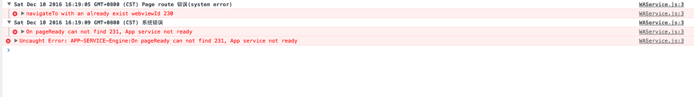

# wechat-doubanDemo
豆瓣微信小程序

## API 介绍
程序中所有api均来自[豆瓣api](https://developers.douban.com/wiki/?title=movie_v2#weekly)

## 更新日志
2016年12月11日发布第一版本：
- 没有引入任何第三方的框架
- 使用了es6的语法，需要在项目中开启es6转es5
- 由于还在公测阶段，后续api变化可能会很大，目前的版本没有问题

## 开发总结
1. 微信小程序既不是web也不是native，微信小程序是基于微信自带的浏览器的x5内核解析，其中封装了很多ui控件，有点类似react-native
2. 小程序开发模式比较呆板，想要修改页面只有修改data，类似react中的setState,小程序中叫setData，但是react可以操作dom而小程序不能
3. 小程序的组件化开发我是利用template模版组建实现，可能有更好的组件化开发框架，但是官方没有介绍我也没有深入研究。但是这种组建化开发的模式有点麻烦，在引入wxml模版的同时，还需要在page的wxss中引入模版的样式，而react中只需要引入一个component就行（因为react中js里可以写html，叫jsx）
4. 微信官方的ide感觉开发有点坑，有时候代码莫名其妙的会消失，所以我选择的webStorm
5. 总体来说，如果小程序的api稳定了，开发速度飞快

## 踩过的坑
1. 标签要闭合，尤其是template标签，不闭合不报错，但是不会渲染，很难排错
2. setState写习惯了，小程序里是setData
3. wx  标签打错了不报错，这样子就很难排错了，因为输入的时候没有自动提示
4. 使用竖向滚动时，需要给<scroll-view/>一个固定高度，通过 WXSS 设置 height。否则没有滚动事件，官方文档上就这么说的，可能是它们的bug
5. 在写scroll-view的样式的时候，如果是竖着滚动，用display:flex布局，那么弹性容器，不要写在scroll-view上面，在另起一个view加上display:flex属性
6. 会有渲染的瑕疵，编译器也会莫名其妙的报错，我的方法是重新编译，在左下角有个编译的按钮
7. wx.requrest  服务器返回404，也是success，貌似只要连接上，服务器有返回就算是success
8. wx.navigateTo(OBJECT)要慎用，微信页面的路径层级只能有5层，如果两个页面的交互可以来回的跳转，应该用重定向，重定向会关闭当前页面跳转到目标页面，否则页面层级超过5层(getCurrentPages()会显示6个页面)，页面跳转会失效。

## 运行效果

